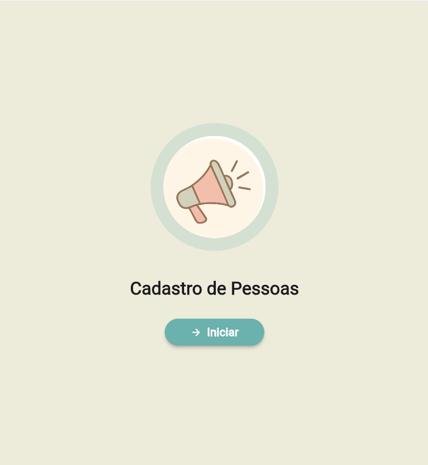

# Cadastro de Pessoas

Aplicativo desenvolvido em Flutter para cadastro e gerenciamento de pessoas com consulta automática de endereço via CEP.

O aplicativo permite que o usuário cadastre dados pessoais e de localização, consulte automaticamente informações de endereço através do ViaCEP, alterne entre os temas claro e escuro, e visualize as pessoas cadastradas na aplicação.

---

## Sobre o projeto

O Cadastro de Pessoas foi desenvolvido como atividade prática do curso de Desenvolvimento de Sistemas.

A proposta do projeto é criar uma aplicação simples de registro e gestão, permitindo que o usuário:

- Visualize uma tela inicial (Splash Screen) animada;
- Alterne entre os temas Claro e Escuro (Dark Mode);
- Consulte automaticamente o endereço (Rua, Bairro, Cidade e Estado) digitando um CEP via API ViaCEP;
- Altere ou preencha manualmente os campos de endereço;
- Cadastre dados de pessoas com validação de campos obrigatórios;
- Salve localmente os cadastros efetuados no dispositivo;
- Visualize a lista completa de pessoas cadastradas;
- Utilize o menu lateral (Drawer) para navegação no aplicativo.

---

## Tecnologias utilizadas

- Flutter
- Dart
- HTTP
- Shared Preferences
- Google Fonts

---

## Prints

- Estão na pasta /assets


---

## Estrutura do projeto

```text
lib/
├── main.dart
│
└── ui/
    ├── splash.dart
    ├── home.dart
    ├── cadastro.dart
    └── style/
        └── theme.dart
